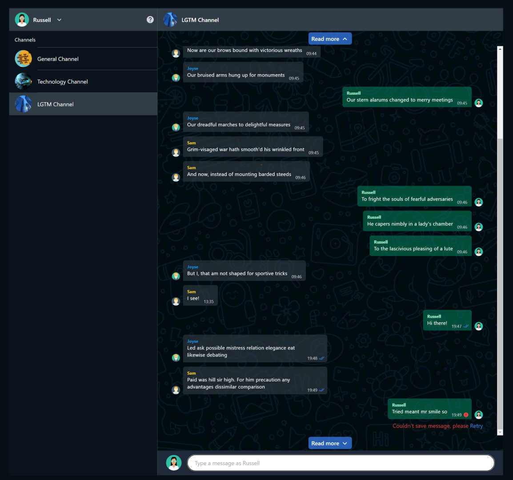

# Chat APP

This is the front end take home test for AnyMind of a chat application.



## Getting Started

To get started run the following commands:

```
npm i
npm run dev
```

## Features

- Users can switch between accounts
- Load messages for each channel
- Draft message on a channel is kept
- Display message status: `SENDING`, `SENT` and `ERROR`
- Read more buttons for older and newer messages
- Users can retry sending a message if an error ocurred
- Handle network error
- Jest tests

## Tests

These tests are run using `jest` with `@testing-library/react` and mainly check the behavior of the pages and components when rendered.

```
npm run test
```
